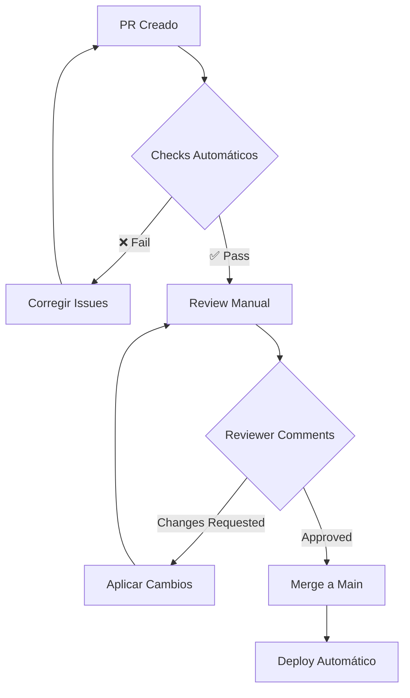
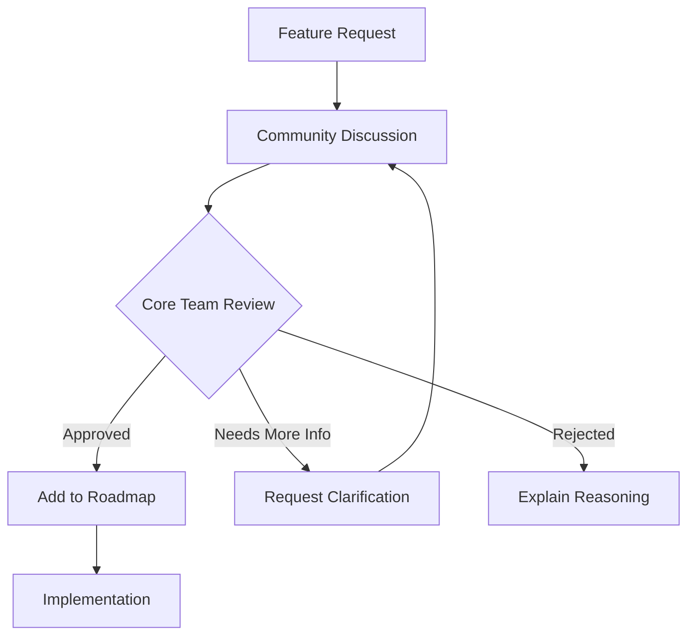

# 🤝 SnackShop - Guía de Contribución

**🏠 Ubicación:** `CONTRIBUTING.md`  
**📅 Última actualización:** 29 de octubre, 2025  
**🎯 Propósito:** Guía para contribuidores: código de conducta, pull requests, code style y review process

---

## 🧭 Navegación

**[📖 Índice General](docs/INDEX.md)** | **[🏠 README](README.md)** | **[🛠️ Development](DEVELOPMENT.md)** | **[🧪 Testing](TESTING.md)**

---

## 📋 Índice

- [Código de Conducta](#-código-de-conducta)
- [Cómo Contribuir](#-cómo-contribuir)
- [Setup para Contribuidores](#-setup-para-contribuidores)
- [Estándares de Código](#-estándares-de-código)
- [Proceso de Pull Request](#-proceso-de-pull-request)
- [Code Review Guidelines](#-code-review-guidelines)
- [Tipos de Contribuciones](#-tipos-de-contribuciones)
- [Documentación](#-documentación)
- [Reportar Bugs](#-reportar-bugs)
- [Solicitar Features](#-solicitar-features)
- [Comunidad y Comunicación](#-comunidad-y-comunicación)
- [Reconocimientos](#-reconocimientos)

---

## 📜 Código de Conducta

### Nuestro Compromiso

En el interés de fomentar un ambiente abierto y acogedor, nosotros como contribuidores y mantenedores nos comprometemos a hacer de la participación en nuestro proyecto y nuestra comunidad una experiencia libre de acoso para todos.

### Nuestros Estándares

#### ✅ Comportamientos que contribuyen a crear un ambiente positivo:

- **Respeto mutuo**: Usar un lenguaje acogedor e inclusivo
- **Diversidad**: Respetar diferentes puntos de vista y experiencias
- **Constructividad**: Enfocarse en lo que es mejor para la comunidad
- **Empatía**: Mostrar empatía hacia otros miembros de la comunidad
- **Colaboración**: Trabajar juntos hacia objetivos comunes

#### ❌ Comportamientos inaceptables:

- Uso de lenguaje o imágenes sexualizadas y atención sexual no deseada
- Comentarios despectivos, ataques personales o políticos
- Acoso público o privado
- Publicar información privada de terceros sin permiso explícito
- Otras conductas que puedan considerarse inapropiadas en un entorno profesional

### Aplicación

Los casos de comportamiento abusivo, acosador o inaceptable pueden ser reportados contactando al equipo del proyecto en [admin@snackshop-project.com]. Todas las quejas serán revisadas e investigadas.

### Consecuencias

Los mantenedores del proyecto tienen el derecho y la responsabilidad de remover, editar o rechazar comentarios, commits, código, ediciones de documentación, issues y otras contribuciones que no estén alineadas con este Código de Conducta.

---

## 🚀 Cómo Contribuir

### Pasos Rápidos para Empezar

```bash
# 1. Fork el repositorio en GitHub
# 2. Clonar tu fork
git clone https://github.com/TU-USERNAME/SnackShack.git
cd SnackShack/SnackShop/www/Snackshop

# 3. Configurar remote upstream
git remote add upstream https://github.com/Equinoxe-Grammer/SnackShack.git

# 4. Crear rama para tu feature
git checkout -b feature/mi-nueva-feature

# 5. Hacer cambios, commit y push
git add .
git commit -m "feat: agregar nueva funcionalidad"
git push origin feature/mi-nueva-feature

# 6. Crear Pull Request en GitHub
```

### Tipos de Contribuciones Bienvenidas

| Tipo | Descripción | Dificultad | Tiempo Estimado |
|------|-------------|------------|-----------------|
| 🐛 **Bug Fixes** | Corregir errores reportados | ⭐ | 1-4 horas |
| ✨ **Features** | Nuevas funcionalidades | ⭐⭐⭐ | 1-3 días |
| 📚 **Documentación** | Mejorar docs, README, comentarios | ⭐ | 2-8 horas |
| 🧪 **Tests** | Agregar/mejorar test coverage | ⭐⭐ | 4-8 horas |
| 🎨 **UI/UX** | Mejoras de interfaz | ⭐⭐ | 1-2 días |
| ⚡ **Performance** | Optimizaciones | ⭐⭐⭐ | 2-5 días |
| 🔒 **Security** | Mejoras de seguridad | ⭐⭐⭐⭐ | 3-7 días |

---

## 🛠️ Setup para Contribuidores

### Configuración Inicial

```bash
# 1. Instalar dependencias de desarrollo
composer install
npm install  # Si hay assets frontend

# 2. Configurar hooks de Git
cp .githooks/pre-commit .git/hooks/pre-commit
chmod +x .git/hooks/pre-commit

# 3. Configurar entorno de desarrollo
cp .env.example .env.development
# Editar .env.development según necesidades

# 4. Ejecutar setup de desarrollo
php scripts/dev-setup.php

# 5. Verificar que todo funciona
composer run test
composer run lint
```

### Herramientas Requeridas

```bash
# Verificar herramientas instaladas
php --version          # PHP 8.1+
composer --version     # Composer 2.0+
git --version          # Git 2.20+
node --version         # Node.js 16+ (opcional)

# Herramientas de desarrollo (instaladas via Composer)
./vendor/bin/phpunit --version      # PHPUnit para testing
./vendor/bin/php-cs-fixer --version # PHP CS Fixer para estilo
./vendor/bin/phpstan --version      # PHPStan para análisis estático
```

### Configuración del Editor

#### VSCode Settings

```json
// .vscode/settings.json
{
    "php.validate.executablePath": "/usr/bin/php",
    "php.format.rules.indentBraces": false,
    "php.format.rules.blankLineBeforeDeclaration": false,
    "files.associations": {
        "*.php": "php"
    },
    "editor.insertSpaces": true,
    "editor.tabSize": 4,
    "editor.detectIndentation": false,
    "files.trimTrailingWhitespace": true,
    "files.insertFinalNewline": true,
    "[php]": {
        "editor.defaultFormatter": "bmewburn.vscode-intelephense-client",
        "editor.tabSize": 4
    },
    "[javascript]": {
        "editor.tabSize": 2
    },
    "[css]": {
        "editor.tabSize": 2
    }
}
```

#### Extensions Recomendadas

```json
// .vscode/extensions.json
{
    "recommendations": [
        "bmewburn.vscode-intelephense-client",
        "xdebug.php-debug",
        "recca0120.vscode-phpunit",
        "valeryanm.vscode-phpsab",
        "ms-vscode.vscode-json",
        "bradlc.vscode-tailwindcss",
        "formulahendry.auto-rename-tag"
    ]
}
```

---

## 📏 Estándares de Código

### PHP Code Style (PSR-12 Extended)

```php
<?php

declare(strict_types=1);

namespace App\Services;

use App\Models\Product;
use App\Repositories\ProductRepositoryInterface;
use App\Exceptions\ValidationException;
use Psr\Log\LoggerInterface;

/**
 * Servicio para gestión de productos
 * 
 * Maneja la lógica de negocio relacionada con productos,
 * incluyendo validación, cálculos y transformaciones.
 * 
 * @package App\Services
 * @author  Equipo SnackShop
 * @since   1.0.0
 */
final class ProductService
{
    public function __construct(
        private ProductRepositoryInterface $productRepository,
        private LoggerInterface $logger
    ) {
    }

    /**
     * Crea un nuevo producto
     *
     * @param array<string, mixed> $data Datos del producto
     * @return Product El producto creado
     * @throws ValidationException Si los datos son inválidos
     */
    public function createProduct(array $data): Product
    {
        // Validar datos de entrada
        $validatedData = $this->validateProductData($data);
        
        try {
            // Crear producto
            $product = $this->productRepository->create($validatedData);
            
            // Log del evento
            $this->logger->info('Product created successfully', [
                'product_id' => $product->getId(),
                'name' => $product->getNombre()
            ]);
            
            return $product;
        } catch (\Exception $e) {
            $this->logger->error('Failed to create product', [
                'data' => $data,
                'error' => $e->getMessage()
            ]);
            
            throw $e;
        }
    }

    /**
     * Valida los datos del producto
     */
    private function validateProductData(array $data): array
    {
        $rules = [
            'nombre' => 'required|string|max:100',
            'precio' => 'required|numeric|min:0.01',
            'categoria_id' => 'required|integer|exists:categorias,id'
        ];

        // Implementación de validación...
        return $data;
    }
}
```

### Naming Conventions

```php
// ✅ Buenos nombres
class ProductService           // Clases: PascalCase
interface PaymentProcessor     // Interfaces: PascalCase + descriptivo
trait Timestampable           // Traits: PascalCase + able/ible

public function getUserById($id)          // Métodos: camelCase
private $connectionPool                   // Propiedades: camelCase
const MAX_RETRY_ATTEMPTS = 3             // Constantes: SNAKE_CASE

// ✅ Variables descriptivas
$activeProducts = $this->getActiveProducts();
$userEmail = $request->getEmail();
$totalPrice = $calculator->calculateTotal($items);

// ❌ Evitar nombres genéricos
$data = [];     // ❌ Muy genérico
$temp = null;   // ❌ No descriptivo
$var1 = '';     // ❌ Sin significado

// ✅ Nombres específicos
$productData = [];      // ✅ Específico
$temporaryToken = null; // ✅ Descriptivo
$userName = '';         // ✅ Con significado
```

### Comments & Documentation

```php
<?php

/**
 * Calcula el precio total de una venta
 * 
 * Este método procesa una lista de items, aplica descuentos,
 * calcula impuestos y retorna el desglose completo del precio.
 * 
 * @param array<int, array{product_id: int, quantity: int}> $items Lista de items
 * @param float $discountPercent Descuento en porcentaje (0-100)
 * @param bool $includeTax Si incluir impuestos en el cálculo
 * @return array{subtotal: float, discount: float, tax: float, total: float}
 * 
 * @throws InvalidArgumentException Si algún item es inválido
 * @throws ProductNotFoundException Si un producto no existe
 * 
 * @example
 * $items = [
 *     ['product_id' => 1, 'quantity' => 2],
 *     ['product_id' => 3, 'quantity' => 1]
 * ];
 * $result = $calculator->calculateTotal($items, 10.0, true);
 * // $result = ['subtotal' => 50.0, 'discount' => 5.0, 'tax' => 7.65, 'total' => 52.65]
 */
public function calculateTotal(array $items, float $discountPercent = 0.0, bool $includeTax = true): array
{
    // Validar parámetros de entrada
    if (empty($items)) {
        throw new InvalidArgumentException('Items array cannot be empty');
    }

    $subtotal = 0.0;
    
    // Calcular subtotal de todos los items
    foreach ($items as $item) {
        // TODO: Implement caching for product prices
        $product = $this->productRepository->findById($item['product_id']);
        
        if (!$product) {
            throw new ProductNotFoundException("Product {$item['product_id']} not found");
        }
        
        $subtotal += $product->getPrecio() * $item['quantity'];
    }
    
    // Aplicar descuento
    $discount = $subtotal * ($discountPercent / 100);
    $afterDiscount = $subtotal - $discount;
    
    // Calcular impuestos si es necesario
    $tax = $includeTax ? $afterDiscount * 0.16 : 0.0; // IVA 16%
    
    $total = $afterDiscount + $tax;
    
    return [
        'subtotal' => round($subtotal, 2),
        'discount' => round($discount, 2),
        'tax' => round($tax, 2),
        'total' => round($total, 2)
    ];
}
```

### Error Handling

```php
// ✅ Manejo específico de errores
try {
    $product = $this->productService->getProductById($productId);
} catch (ProductNotFoundException $e) {
    // Error específico - producto no encontrado
    $this->logger->warning('Product not found', ['product_id' => $productId]);
    return $this->render('errors/product-not-found.php', ['id' => $productId]);
} catch (DatabaseException $e) {
    // Error de base de datos
    $this->logger->error('Database error while fetching product', [
        'product_id' => $productId,
        'error' => $e->getMessage()
    ]);
    return $this->render('errors/500.php');
} catch (\Exception $e) {
    // Error genérico - último recurso
    $this->logger->critical('Unexpected error', [
        'product_id' => $productId,
        'error' => $e->getMessage(),
        'trace' => $e->getTraceAsString()
    ]);
    return $this->render('errors/500.php');
}

// ✅ Validación temprana
public function createProduct(array $data): Product
{
    // Fail fast - validar inmediatamente
    if (empty($data['nombre'])) {
        throw new ValidationException('Product name is required');
    }
    
    if ($data['precio'] <= 0) {
        throw new ValidationException('Product price must be greater than zero');
    }
    
    // Continuar con la lógica...
}
```

---

## 🔄 Proceso de Pull Request

### 1. Preparación del PR

```bash
# Asegurar que la rama está actualizada
git checkout main
git pull upstream main
git checkout feature/mi-feature
git rebase main

# Ejecutar checks locales
composer run lint       # Verificar estilo de código
composer run analyze    # Análisis estático
composer run test       # Ejecutar tests
composer run test-coverage  # Verificar coverage
```

### 2. Template de Pull Request

```markdown
## 🎯 Descripción

Breve descripción de los cambios realizados.

### Tipo de cambio
- [ ] 🐛 Bug fix (cambio que corrige un issue)
- [ ] ✨ Nueva feature (cambio que añade funcionalidad)
- [ ] 💥 Breaking change (fix o feature que causaría que funcionalidad existente no funcione como se espera)
- [ ] 📚 Documentación (cambios solo en documentación)
- [ ] 🎨 Estilo (formato, espacios, etc; sin cambios de código)
- [ ] ♻️ Refactor (cambio de código que no corrige bug ni añade feature)
- [ ] ⚡ Performance (cambio que mejora performance)
- [ ] 🧪 Tests (añadir tests faltantes o corregir tests existentes)

## 🧪 Cómo se ha probado

Describe las pruebas que has ejecutado para verificar tus cambios.

- [ ] Tests unitarios pasan
- [ ] Tests de integración pasan
- [ ] Probado manualmente en [especificar entorno]
- [ ] Coverage de código mantenido/mejorado

## 📋 Checklist

- [ ] Mi código sigue los estándares de estilo del proyecto
- [ ] He realizado una auto-revisión de mi código
- [ ] He comentado mi código, particularmente en áreas difíciles de entender
- [ ] He realizado los cambios correspondientes en la documentación
- [ ] Mis cambios no generan nuevas advertencias
- [ ] He añadido tests que prueban que mi fix es efectivo o que mi feature funciona
- [ ] Los tests unitarios nuevos y existentes pasan localmente con mis cambios
- [ ] Cualquier cambio dependiente ha sido merged y publicado en módulos downstream

## 📷 Screenshots (si aplica)

Si hay cambios en la UI, incluir screenshots del antes y después.

## 🔗 Issues relacionados

Fixes #(número del issue)

## 📝 Notas adicionales

Cualquier información adicional que los reviewers deberían saber.
```

### 3. Criterios para Aprobar PR

#### ✅ Requirements Mínimos

- **Tests**: Todos los tests pasan (unit + integration)
- **Coverage**: No reducir coverage existente
- **Linting**: Código pasa todos los checks de estilo
- **Documentation**: Cambios documentados apropiadamente
- **Breaking Changes**: Claramente identificados y justificados

#### ✅ Criterios de Calidad

- **Single Responsibility**: Cada PR tiene un propósito claro
- **Atomic Changes**: Cambios lógicamente relacionados juntos
- **Readable**: Código fácil de entender
- **Tested**: Nueva funcionalidad tiene tests apropiados
- **Backwards Compatible**: No rompe funcionalidad existente

### 4. Review Process



---

## 👥 Code Review Guidelines

### Para Reviewers

#### 🎯 Qué Revisar

**Funcionalidad**
- ¿El código hace lo que se supone que debe hacer?
- ¿Los casos edge están manejados?
- ¿Hay riesgos de seguridad?

**Calidad del Código**
- ¿El código es legible y mantenible?
- ¿Se siguen los patrones establecidos?
- ¿Hay duplicación innecesaria?

**Performance**
- ¿Hay queries N+1?
- ¿Se usan índices apropiados?
- ¿El algoritmo es eficiente?

**Testing**
- ¿Los tests cubren los casos importantes?
- ¿Los tests son mantenibles?
- ¿El coverage es apropiado?

#### 💬 Cómo Dar Feedback

```markdown
# ✅ Feedback Constructivo

## Problema Específico
**Issue:** Esta función podría causar un memory leak con datasets grandes.

**Sugerencia:** Considera usar un generator para procesar los datos en chunks.

**Ejemplo:**
```php
// En lugar de:
public function processAllData() {
    $data = $this->getAllData(); // Carga todo en memoria
    return array_map($this->process, $data);
}

// Usar:
public function processAllData() {
    foreach ($this->getDataChunks() as $chunk) {
        yield from array_map($this->process, $chunk);
    }
}
```

## Pregunta para Clarificar
**Question:** ¿Has considerado qué pasa si el producto ya está en el carrito? 
¿Deberíamos incrementar la cantidad o mostrar un error?

## Reconocimiento Positivo
**Nice work!** Me gusta cómo has separado la validación del procesamiento. 
Hace el código mucho más testeable.
```

#### ❌ Feedback a Evitar

```markdown
# ❌ Feedback No Constructivo

"Este código está mal."
// Sin explicar qué está mal o cómo mejorarlo

"Esto no funcionará."
// Sin evidencia o sugerencias alternativas

"¿Por qué hiciste esto así?"
// Tono crítico sin ofrecer ayuda

"Cambia todo esto."
// Sin dirección específica
```

### Para Authors

#### 📝 Responder a Feedback

```markdown
# ✅ Buenas Respuestas

## Aceptar Sugerencia
"Excelente punto! He implementado el generator como sugeriste. 
Commit: abc123f"

## Explicar Decisión
"Decidí usar este approach porque mantenemos compatibility con 
la API existente. Si cambiamos esto, rompería 3 endpoints. 
¿Te parece aceptable o prefieres que creemos una nueva versión de la API?"

## Pedir Clarificación
"No estoy seguro de entender tu sugerencia sobre el caching. 
¿Podrías dar un ejemplo de cómo implementarías el TTL variable?"

## Agradecer Feedback
"Gracias por revisar! He aplicado todas las sugerencias. 
El punto sobre testing edge cases era muy válido."
```

---

## 🎯 Tipos de Contribuciones

### 🐛 Bug Fixes

#### Proceso para Bug Fixes

```bash
# 1. Crear issue si no existe
# 2. Crear rama específica
git checkout -b fix/issue-123-login-error

# 3. Escribir test que reproduzca el bug
# tests/Unit/Auth/LoginTest.php
public function testLoginWithSpecialCharacters() {
    // Test que falla por el bug
}

# 4. Implementar fix
# 5. Verificar que test pasa
composer run test

# 6. Commit con referencia al issue
git commit -m "fix: resolve login error with special characters

Fixes issue where users with special characters in email
couldn't log in due to improper URL encoding.

Fixes #123"
```

#### Template para Bug Reports

```markdown
## 🐛 Bug Report

### Descripción
Descripción clara y concisa del bug.

### Pasos para Reproducir
1. Ir a '...'
2. Hacer click en '....'
3. Scrollear hasta '....'
4. Ver error

### Comportamiento Esperado
Descripción clara de lo que esperabas que pasara.

### Comportamiento Actual
Descripción clara de lo que pasó en su lugar.

### Screenshots
Si aplica, añadir screenshots para ayudar a explicar el problema.

### Entorno
- OS: [e.g. iOS]
- Browser [e.g. chrome, safari]
- Version [e.g. 22]
- PHP Version: [e.g. 8.1.0]

### Contexto Adicional
Cualquier otro contexto sobre el problema.
```

### ✨ New Features

#### Proceso para Features

```bash
# 1. Crear issue de feature request
# 2. Discutir approach en el issue
# 3. Crear rama
git checkout -b feature/product-variants

# 4. Implementar con TDD
# - Escribir tests primero
# - Implementar funcionalidad
# - Refactor si es necesario

# 5. Documentar la feature
# - Actualizar README si es necesario
# - Añadir documentación de API
# - Incluir ejemplos de uso
```

#### Template para Feature Requests

```markdown
## ✨ Feature Request

### ¿Tu feature request está relacionada con un problema?
Descripción clara y concisa del problema. Ej. "Estoy frustrado cuando [...]"

### Describe la solución que te gustaría
Descripción clara y concisa de lo que quieres que pase.

### Describe alternativas que has considerado
Descripción clara y concisa de cualquier solución o feature alternativa que hayas considerado.

### Contexto adicional
Añade cualquier otro contexto o screenshots sobre el feature request aquí.

### Criterios de Aceptación
- [ ] Como usuario, puedo...
- [ ] Cuando hago X, entonces Y pasa...
- [ ] El sistema debe...
```

### 📚 Documentation

#### Contribuir a Documentación

```bash
# Documentación técnica
docs/                   # Documentación principal
README.md              # Overview del proyecto
DEVELOPMENT.md         # Setup para desarrolladores
API.md                 # Documentación de API

# Documentación en código
src/                   # PHPDoc en clases y métodos
public/assets/js/      # JSDoc en JavaScript
```

#### Estándares de Documentación

```php
/**
 * Breve descripción de una línea
 * 
 * Descripción más detallada que puede extenderse
 * a múltiples líneas si es necesario.
 * 
 * @param Type $param Descripción del parámetro
 * @return Type Descripción de lo que retorna
 * @throws ExceptionType Cuándo se lanza esta excepción
 * 
 * @example
 * $result = $service->methodName($param);
 * 
 * @since 1.0.0
 * @author Nombre del Autor
 */
public function methodName(Type $param): Type
{
    // Implementation
}
```

---

## 🗣️ Reportar Bugs

### Severity Levels

| Level | Descripción | Tiempo de Respuesta |
|-------|-------------|-------------------|
| 🔴 **Critical** | App crashed, data loss, security vulnerabilities | 24 horas |
| 🟠 **High** | Major functionality broken, workaround exists | 3 días |
| 🟡 **Medium** | Minor functionality issues, cosmetic problems | 1 semana |
| 🟢 **Low** | Enhancement requests, nice-to-have features | 2 semanas |

### Bug Report Checklist

- [ ] ¿Has buscado en issues existentes?
- [ ] ¿Puedes reproducir el bug consistentemente?
- [ ] ¿Has incluido pasos detallados para reproducir?
- [ ] ¿Has incluido información del entorno?
- [ ] ¿Has incluido logs/screenshots relevantes?
- [ ] ¿Has probado con la última versión?

---

## 💡 Solicitar Features

### Feature Evaluation Criteria

Los features son evaluados basándose en:

1. **Impact**: ¿Cuántos usuarios se beneficiarán?
2. **Effort**: ¿Cuánto trabajo requiere implementar?
3. **Alignment**: ¿Se alinea con la visión del producto?
4. **Maintenance**: ¿Qué carga de mantenimiento añade?

### Feature Request Process



---

## 🏆 Reconocimientos

### Hall of Fame

Reconocemos a nuestros contribuidores más activos:

#### 🥇 Core Contributors
- **@equinoxe-grammer** - Project founder & lead maintainer
- **@contributor1** - Security & performance expert
- **@contributor2** - Documentation & testing specialist

#### 🥈 Regular Contributors
- **@contributor3** - UI/UX improvements
- **@contributor4** - Bug fixes & maintenance
- **@contributor5** - API development

#### 🥉 Community Champions
- **@contributor6** - Community support & mentoring
- **@contributor7** - Issue triage & reproduction
- **@contributor8** - Translations & localization

### Contribution Recognition

Reconocemos contribuciones de varias formas:

- **GitHub Profile**: Contribuciones aparecen en tu perfil
- **CONTRIBUTORS.md**: Lista de todos los contribuidores
- **Release Notes**: Menciones en notas de versión
- **Social Media**: Reconocimiento en redes sociales
- **Swag**: Stickers y merchandise para contributors activos

### Levels of Recognition

| Nivel | Criterio | Beneficios |
|-------|----------|------------|
| **Contributor** | Primera contribución merged | Aparición en CONTRIBUTORS.md |
| **Regular** | 5+ PRs merged | Acceso a channels privados |
| **Core** | 20+ PRs + domain expertise | Voting rights en decisiones |
| **Maintainer** | Invitación del equipo | Admin access al repositorio |

---

## 📞 Comunidad y Comunicación

### Canales de Comunicación

- **📧 Email**: admin@snackshop-project.com
- **💬 Discord**: [SnackShop Community](https://discord.gg/snackshop)
- **🐦 Twitter**: [@SnackShopDev](https://twitter.com/snackshodev)
- **📱 GitHub Discussions**: Para discusiones técnicas
- **📋 GitHub Issues**: Para bugs y feature requests

### Meetings & Events

- **Weekly Office Hours**: Jueves 3-4 PM (GMT-6)
- **Monthly Community Call**: Primer viernes de cada mes
- **Quarterly Roadmap Review**: Cada 3 meses
- **Annual Contributors Summit**: Una vez al año (virtual)

### Getting Help

#### Para Nuevos Contribuidores

1. **Lee esta guía completamente**
2. **Configura tu entorno de desarrollo**
3. **Busca issues etiquetados como "good first issue"**
4. **Únete a nuestro Discord para hacer preguntas**
5. **Asiste a Office Hours si necesitas ayuda en vivo**

#### Para Contribuidores Experienciales

1. **Considera mentorear nuevos contribuidores**
2. **Participa en discusiones de arquitectura**
3. **Ayuda con code reviews**
4. **Propón mejoras al proceso de contribución**

---

## 🔗 Documentos Relacionados

- **[📖 Índice General](docs/INDEX.md)** — Navegación completa del manual
- **[🛠️ Development](DEVELOPMENT.md)** — Setup y herramientas de desarrollo
- **[🧪 Testing](TESTING.md)** — Guías de testing y quality assurance
- **[🏗️ Architecture](ARCHITECTURE.md)** — Comprende la arquitectura del sistema
- **[🔌 API](API.md)** — Documentación de endpoints para desarrollo
- **[🚀 Deployment](DEPLOYMENT.md)** — Guías de despliegue y producción

---

## 🙏 Agradecimientos

Gracias por considerar contribuir a SnackShop! Tu tiempo y esfuerzo ayudan a hacer este proyecto mejor para todos. 

Cada contribución, sin importar el tamaño, es valiosa y apreciada. Desde reportar un bug hasta implementar una feature major, todo ayuda a mejorar el proyecto.

**¡Esperamos ver tus contribuciones pronto!** 🎉

---

**[📖 Índice](docs/INDEX.md)** | **[🛠️ Ver Development](DEVELOPMENT.md)** | **[🧪 Ver Testing](TESTING.md)** | **[🏗️ Ver Arquitectura](ARCHITECTURE.md)**